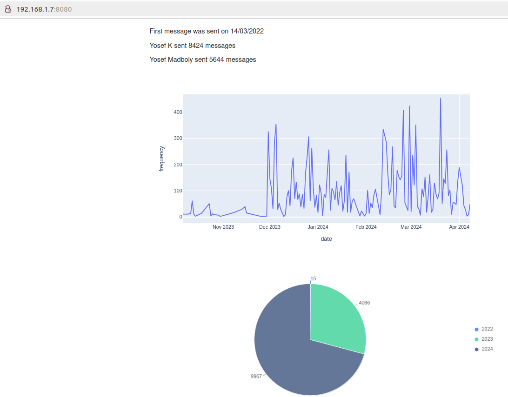

# Whatsapp Analyzer

This is a simple python backend service that analyzes your whatsapp chat history and gives you some insights about your chat history.

> The script is still under development and more insights will be added soon. I would say this is just a prototype.

## Visualization Insights and charts Snapshot:

<!-- snapshot.png -->

## Insights provided:

1. Total number of words sent by each person.
2. Yearly distribution of messages rate.
3. [Soon] Daily distribution of messages rate. [Done]

## How to export chat history:

1. Open the chat you want to export.
2. Click on the three dots on the top right corner.
3. Click on 'More'.
4. Click on 'Export chat'.
5. Choose 'Without media'.
6. Share the chat with the script.

## How to run (No Docker):

1. Clone the repository.
2. Run `pip install -r requirements.txt` to install the required packages.
3. Run the script using `python main.py`.
4. Open the generated report from the local-server url provided and enjoy the insights.

## How to run with Docker:

1. Build the Docker image by running: `docker build -t whatsapp-analyzer .`
2. Run the Docker container with: `docker run -p 8080:8080 whatsapp-analyzer`

This will start your application and map the application's port 8080 to port 8080 on your host machine (Ex: http://192.168.1.7:8080/).

## Future work:

1. Add more insights.
2. Add a frontend to visualize the insights.
3. Add API support.
